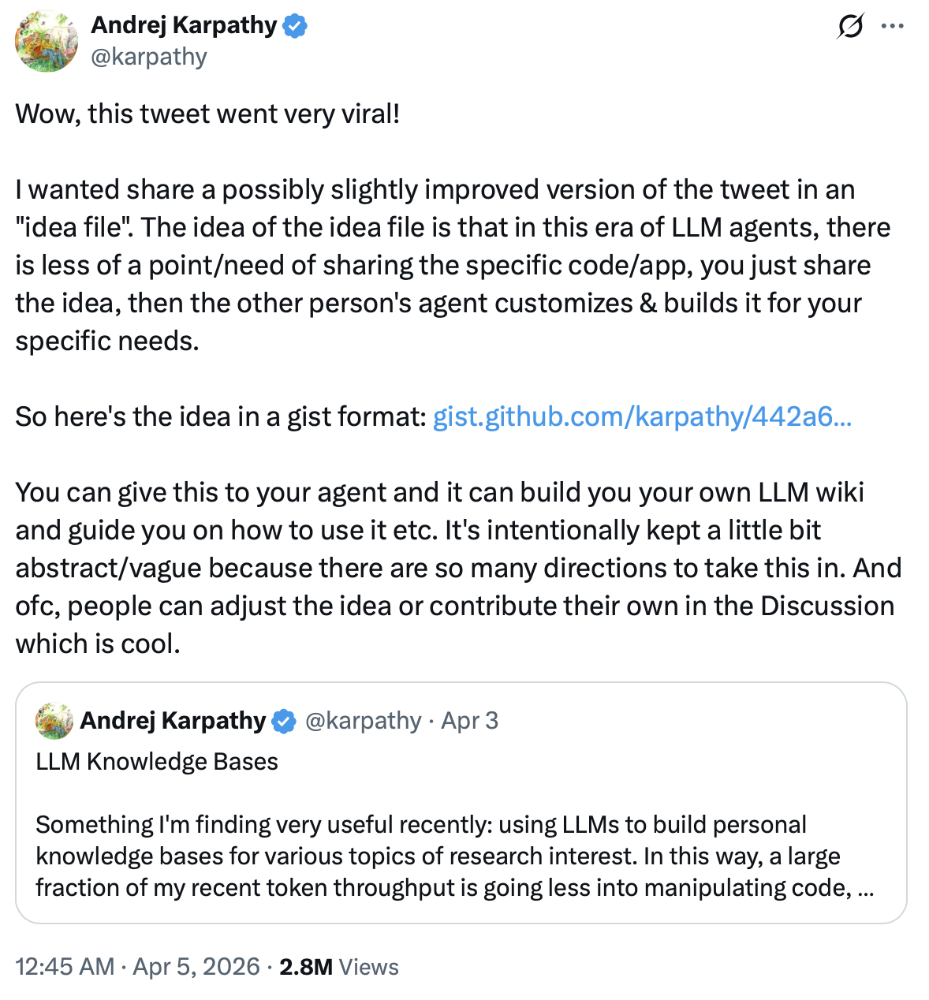

# llm-wiki

**A reusable skill for building LLM wikis with Claude Code, Cursor, Codex, and other Agent Skills tools.**

[](LICENSE)
[](https://github.com/uovme/llm-wiki)
[](https://github.com/uovme/llm-wiki)
[](https://agentskills.io)
[](https://github.com/uovme/llm-wiki#install)

<p align="center">
  
</p>

`llm-wiki` packages [Karpathy's LLM Wiki idea](https://gist.github.com/karpathy/442a6bf555914893e9891c11519de94f) into one installable [Agent Skills](https://agentskills.io) skill. Your coding agent ingests sources into `RAW/`, compiles durable knowledge pages into `Wiki/`, answers questions with citations, reflects on accumulated knowledge, and lints the wiki for consistency.

## What Is an LLM Wiki?

An **LLM wiki** is a knowledge system where the LLM maintains structured wiki pages instead of re-searching raw documents on every question. New sources are compiled into durable markdown pages, cross-references are updated over time, and answers cite the wiki pages that already contain the synthesized knowledge.

This skill gives you four operations:

| Operation | What it does | Output |
|-----------|--------------|--------|
| **Ingest** | Collects a source into `RAW/` and compiles it into the wiki | New or updated living pages + ingest record |
| **Query** | Searches the wiki and answers with citations | Grounded answers; optionally archived to `Wiki/Query/` |
| **Reflect** | Synthesizes long-term judgments from accumulated pages | Reflection pages in `Wiki/<topic>/reflect/` |
| **Lint** | Checks index integrity, links, and wiki health | Auto-fixes + lint reports in `Wiki/<topic>/lint/` or `Wiki/Lint/` |

See [SKILL.md](SKILL.md) for the full skill specification.

## LLM Wiki vs RAG

| Approach | Knowledge lives in | When synthesis happens | Good for |
|----------|--------------------|------------------------|----------|
| **RAG** | Raw chunks and embeddings | At query time | Broad retrieval across large corpora |
| **LLM Wiki** | Curated markdown pages | During ingest and maintenance | Compounding knowledge, summaries, and durable cross-links |

This skill is optimized for the wiki model: knowledge that improves over time instead of re-deriving relationships on every query.

## Usage Stats

Based on a production knowledge base maintained daily since April 2026:

- **94** wiki articles across **13** topic directories
- **99** source materials ingested
- **87** operation log entries in the last 7 days

See [examples/](examples/) for sample wiki pages, source files, and operation logs.

## Install

```bash
npx add-skill uovme/llm-wiki
```

Works with any tool that supports the [Agent Skills](https://agentskills.io) standard.

## Quick Start

### 1. Ingest your first source

Give the skill a URL, a file, or pasted text:

> "Ingest this article: https://example.com/attention-is-all-you-need"

The skill stores the source in `RAW/`, then compiles or updates the right knowledge pages in `Wiki/`.

### 2. Ask your wiki a question

> "What do I know about attention mechanisms?"

The skill searches the wiki and answers with citations linking back to your markdown pages.

### 3. Reflect on a topic

> "Write a reflection on the evolution of attention mechanisms"

The skill synthesizes a higher-level analysis from your accumulated living pages into `Wiki/<topic>/reflect/`.

### 4. Keep the wiki healthy

> "Lint my wiki"

Checks for broken links, missing index entries, stale cross-references, and related issues. Reports are saved to `Wiki/<topic>/lint/` or `Wiki/Lint/`.

## How the Workflow Works

The core idea from Karpathy: the LLM maintains the wiki while the human focuses on choosing sources and asking good questions.

```text
your-project/
├── RAW/              ← Immutable source material
│   └── topic/
│       └── 2026-04-03-source-article.md
├── Wiki/             ← Compiled knowledge pages maintained by the LLM
│   ├── topic/
│   │   ├── concept-name.md          ← living page
│   │   ├── ingest/                  ← ingest records
│   │   ├── reflect/                 ← reflection pages
│   │   └── lint/                    ← topic lint reports
│   ├── Query/        ← Archived query snapshots
│   ├── Lint/         ← Cross-topic lint reports
│   └── index.md      ← Global table of contents
```

Each new source can update multiple pages, strengthen cross-references, and record contradictions. That is what makes the wiki compound over time.

## Tool Compatibility

This skill follows the [agentskills.io](https://agentskills.io) open standard:

| Tool | Install method |
|------|----------------|
| Claude Code | `npx add-skill uovme/llm-wiki` |
| Cursor | `npx add-skill uovme/llm-wiki` |
| Codex CLI | Copy to `.agents/skills/llm-wiki/` |
| OpenCode | `npx add-skill uovme/llm-wiki` |
| Other tools | Copy `SKILL.md` and `references/` into the tool's skill directory |

## FAQ

### What is the difference between an LLM wiki and a personal wiki?

An LLM wiki is maintained by the model. It updates summaries, cross-links, index entries, and contradictions as new material arrives. A normal personal wiki depends on manual editing.

### What sources can I ingest?

Web pages, papers, blog posts, PDFs, markdown files, text files, and pasted text. The skill converts everything into markdown under `RAW/` and compiles it into `Wiki/`.

### What is a reflection page?

A reflection page is a higher-level synthesis that captures long-term judgments, evolving perspectives, and cross-cutting analysis across multiple living pages. Unlike living pages that track individual concepts, reflections provide the "so what" layer.

### Is this production-ready?

The workflow is based on a real knowledge base with 94 articles and 99 sources maintained daily since April 2026. The repo includes examples, templates, and a design spec.

## Inspired By

Unofficial community implementation of the workflow from [Karpathy's LLM Wiki idea](https://gist.github.com/karpathy/442a6bf555914893e9891c11519de94f). The value here is the reusable workflow, prompt structure, and battle-tested knowledge-compilation rules.

See also: [lucasastorian/llmwiki](https://github.com/lucasastorian/llmwiki), [atomicmemory/llm-wiki-compiler](https://github.com/atomicmemory/llm-wiki-compiler).

## License

[MIT](LICENSE)
